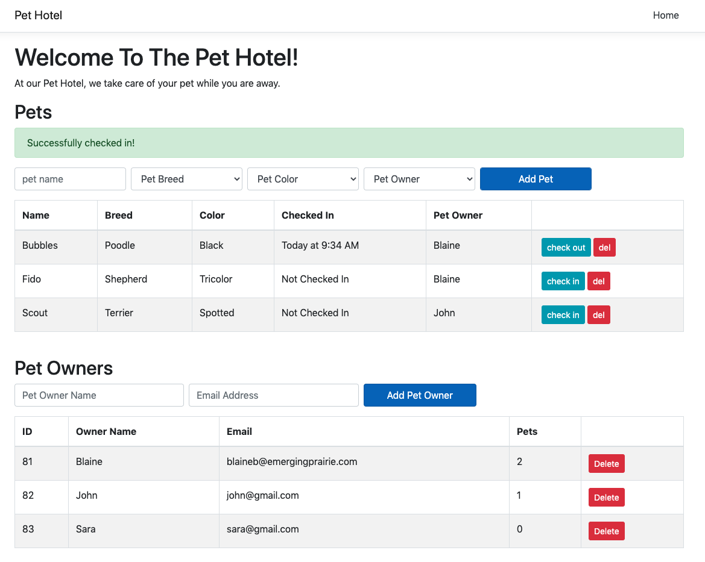

# Pet Hotel (Frontend)

## Description

_Duration: 4 Day Sprint_

This application was a pair-programming activity with [James Kelley](https://github.com/jkkelley). In just one week the two of use learned how to build a back end entirely in C# - a testimant to how quickly we can learn new languages!

## Front End
View the front end of this application [here](https://github.com/MMettille/pet-hotel-backend).

## Screenshots
### Pet Hotel UI

### Passing Tests (npm test)

## Technologies

This appliciaton was made in four days weeks with these technologies:
- C#
- React
- Redux
- HTML
- CSS
- Javascript
- PostgreSQL

## Acknowledgement
A huge shoutout to our instructor, Dane at [Prime Digital Academy](www.primeacademy.io) for downloading all this code into our brains!

## Support
If you have suggestions or issues, please email Mary at [mary.mettille.brist@gmail.com]
